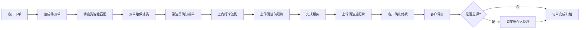

## 1. 产品概述

本系统是面向家政保洁公司的全流程派单与服务管理工具，覆盖客户在线下单、调度员智能派单、保洁员上门服务、客户评价付款、绩效统计分析等完整业务闭环。解决传统家政行业派单效率低、服务质量难管控、绩效核算复杂等痛点。

- **核心目标**：提升派单效率30%，降低调度成本，标准化服务流程，提升客户满意度
- **目标用户**：家政公司客户、调度员、保洁员、管理人员

## 2. 核心 Features

### 2.1 用户角色

| 角色 | 注册方式 | 核心权限 |
|------|----------|----------|
| 客户 | 手机号注册 | 下单、支付、评价、管理定期服务 |
| 调度员 | 管理员分配 | 订单管理、派单调度、差评处理、排班管理 |
| 保洁员 | 管理员分配 | 接单、打卡、上传照片、查看绩效 |
| 管理员 | 系统初始账号 | 人员管理、参数配置、数据统计 |

### 2.2 功能模块

1. **客户下单系统**：服务选择、时间预约、地址管理、定期服务设置
2. **调度派单中心**：订单池、保洁员排班、智能匹配、手动派单
3. **保洁员工作台**：待接订单、服务打卡、照片上传、服务记录
4. **支付评价系统**：订单支付、星级评价、差评预警
5. **人员档案管理**：保洁员档案、技能标签、评分记录
6. **绩效统计分析**：月度报表、提成核算、绩效排名

### 2.3 页面详情

| 页面名称 | 模块名称 | 功能描述 |
|---------|----------|----------|
| 客户首页 | 服务选择 | 日常保洁/深度清洁/搬家打扫三种服务卡片展示 |
| 客户首页 | 快速下单 | 选择时间、地址、房屋面积，一键下单 |
| 客户首页 | 定期服务 | 设置周/半月/月固定上门频次，自动续单 |
| 订单详情页 | 订单信息 | 服务类型、时间、地址、面积、价格 |
| 订单详情页 | 服务进度 | 派单→接单→签到→服务中→完成→评价 |
| 订单详情页 | 照片对比 | 清洁前后照片滑动对比 |
| 订单详情页 | 支付评价 | 微信/支付宝支付、星级评价、文字反馈 |
| 调度中心 | 订单列表 | 当日所有订单状态、筛选、搜索 |
| 调度中心 | 排班看板 | 保洁员当日排班、忙闲状态、技能标签 |
| 调度中心 | 智能派单 | 按距离、技能、评分自动推荐3名保洁员 |
| 调度中心 | 差评预警 | 差评订单红色高亮，一键介入处理 |
| 保洁员首页 | 待接订单 | 新订单提醒、距离显示、一键接单 |
| 保洁员首页 | 服务打卡 | GPS定位签到、清洁前/后照片上传 |
| 保洁员档案 | 个人信息 | 头像、姓名、联系方式、技能标签 |
| 保洁员档案 | 服务记录 | 历史订单、客户评价、平均评分 |
| 绩效统计页 | 数据概览 | 接单量、平均评分、客户满意度 |
| 绩效统计页 | 排行榜 | 保洁员月度排名、提成金额 |
| 绩效统计页 | 提成核算 | 按单量、评分自动计算绩效奖励 |

## 3. 核心流程

### 3.1 服务全流程

客户选择服务类型和时间，填写地址和面积提交订单→系统生成待派单→调度员查看订单和保洁员排班→智能匹配推荐（距离+技能+评分）→调度员派单→保洁员收到推送确认接单→保洁员上门GPS打卡签到→拍摄清洁前照片→服务完成拍摄清洁后照片→客户查看对比照确认满意→在线支付→客户评价→差评自动推送调度员介入。

### 3.2 定期服务流程

客户设置固定上门频次→系统生成定期服务计划→到期前3天自动创建订单→自动派单给历史好评保洁员→提前1天通知客户→服务完成后自动续单。

## 4. 界面设计

### 4.1 设计风格

- **主色调**：清新绿（#10B981）代表清洁、专业、可信赖
- **辅助色**：暖橙（#F59E0B）用于提醒、行动按钮
- **警示色**：珊瑚红（#EF4444）用于差评预警、错误提示
- **中性色**：米白（#FAFAF9）、深灰（#1F2937）、中灰（#6B7280）
- **按钮风格**：圆润大按钮（圆角12px），微悬浮阴影效果
- **字体**：标题使用Noto Sans SC Bold，正文使用Noto Sans SC Regular
- **布局风格**：卡片式布局，圆角16px，柔和阴影，充足留白
- **图标**：线性简约图标，统一24px尺寸，1.5px线宽

### 4.2 页面设计概览

| 页面名称 | 模块名称 | UI 元素 |
|---------|----------|---------|
| 客户首页 | 服务选择 | 三张服务卡片，大图标+标题+价格+特点标签，hover上浮效果 |
| 客户首页 | 快速下单 | 时间选择器、地址输入、面积滑块，分步表单引导 |
| 调度中心 | 订单列表 | 左右分栏，左侧订单池，右侧排班看板，拖拽派单交互 |
| 调度中心 | 智能匹配 | 推荐保洁员卡片，显示距离、评分、技能匹配度百分比 |
| 保洁员首页 | 待接订单 | 大卡片展示，地图显示距离，醒目的接单/拒单按钮 |
| 订单详情页 | 照片对比 | 左右滑动对比条，清洁前/后照片叠加效果 |
| 绩效统计页 | 数据看板 | 大数字指标，趋势折线图，横向柱状排行榜 |

### 4.3 响应式设计

- **桌面端**：1280px以上，左右分栏布局，充分利用屏幕空间
- **平板端**：768px-1280px，上下布局，可折叠侧边栏
- **移动端**：768px以下，单列布局，底部标签栏导航，触控优化
- **保洁员端**：优先移动端优化，大按钮、大文字、简化操作流程

## 5. 核心业务规则

1. **派单规则**：优先推荐3公里内、评分4.8以上、具备对应服务技能的保洁员
2. **差评规则**：评分≤2星自动标记为差评，10分钟内推送给调度员
3. **定期服务**：支持每周1次、每2周1次、每月1次三种频次，可随时暂停/取消
4. **提成规则**：基础提成+评分奖励，评分4.9以上额外奖励10%
5. **自动续单**：定期服务到期前3天自动创建订单，客户无异议则默认确认
