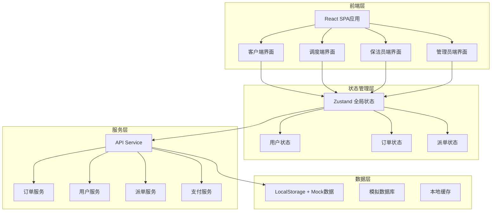
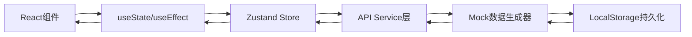
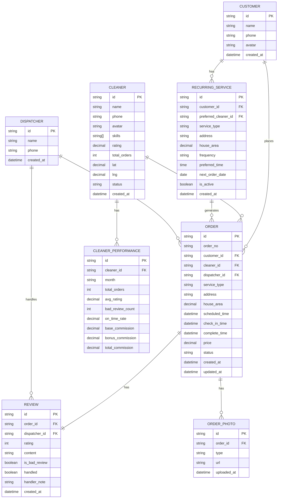

## 1. 架构设计



## 2. 技术描述

- **前端框架**：React@18.2.0 + TypeScript
- **构建工具**：Vite@5.2.0
- **样式方案**：TailwindCSS@3.4.0
- **状态管理**：Zustand@4.5.0
- **路由管理**：React Router@6.22.0
- **图表组件**：Recharts@2.12.0
- **图标库**：Lucide React@0.344.0
- **日期处理**：date-fns@3.3.0
- **表单处理**：react-hook-form@7.51.0
- **后端**：无后端，使用Mock数据模拟API
- **数据库**：LocalStorage存储 + JSON模拟数据

## 3. 路由定义

| 路由路径 | 页面名称 | 访问角色 |
|---------|----------|----------|
| `/` | 登录页 | 所有 |
| `/customer` | 客户首页 | 客户 |
| `/customer/order` | 下单页 | 客户 |
| `/customer/orders` | 我的订单 | 客户 |
| `/customer/order/:id` | 订单详情 | 客户 |
| `/customer/recurring` | 定期服务 | 客户 |
| `/dispatcher` | 调度中心 | 调度员 |
| `/dispatcher/orders` | 订单管理 | 调度员 |
| `/dispatcher/schedule` | 排班看板 | 调度员 |
| `/dispatcher/bad-reviews` | 差评处理 | 调度员 |
| `/cleaner` | 保洁员首页 | 保洁员 |
| `/cleaner/orders` | 我的订单 | 保洁员 |
| `/cleaner/order/:id` | 服务详情 | 保洁员 |
| `/cleaner/profile` | 我的档案 | 保洁员 |
| `/admin` | 管理首页 | 管理员 |
| `/admin/cleaners` | 保洁员管理 | 管理员 |
| `/admin/statistics` | 绩效统计 | 管理员 |

## 4. API 类型定义

```typescript
// 用户类型
type UserRole = 'customer' | 'dispatcher' | 'cleaner' | 'admin';

interface User {
  id: string;
  role: UserRole;
  name: string;
  phone: string;
  avatar?: string;
  createdAt: string;
}

interface Customer extends User {
  role: 'customer';
  addresses: Address[];
  recurringServices: RecurringService[];
}

interface Cleaner extends User {
  role: 'cleaner';
  skills: ServiceType[];
  rating: number;
  totalOrders: number;
  location: GeoLocation;
  status: 'available' | 'busy' | 'offline';
}

interface Dispatcher extends User {
  role: 'dispatcher';
}

// 订单类型
type ServiceType = 'daily' | 'deep' | 'moving';
type OrderStatus = 'pending' | 'assigned' | 'accepted' | 'checked_in' | 'in_progress' | 'completed' | 'paid' | 'reviewed' | 'cancelled';

interface Address {
  id: string;
  province: string;
  city: string;
  district: string;
  detail: string;
  houseArea: number;
  location: GeoLocation;
}

interface GeoLocation {
  lat: number;
  lng: number;
}

interface OrderPhoto {
  id: string;
  type: 'before' | 'after';
  url: string;
  uploadedAt: string;
}

interface Review {
  id: string;
  orderId: string;
  rating: number;
  content: string;
  createdAt: string;
  isBadReview: boolean;
  handled?: boolean;
  handlerNote?: string;
}

interface Order {
  id: string;
  orderNo: string;
  customerId: string;
  customer: Customer;
  cleanerId?: string;
  cleaner?: Cleaner;
  serviceType: ServiceType;
  address: Address;
  houseArea: number;
  scheduledTime: string;
  actualCheckInTime?: string;
  actualCompleteTime?: string;
  price: number;
  status: OrderStatus;
  photos: OrderPhoto[];
  review?: Review;
  createdAt: string;
  updatedAt: string;
}

interface RecurringService {
  id: string;
  customerId: string;
  serviceType: ServiceType;
  address: Address;
  houseArea: number;
  frequency: 'weekly' | 'biweekly' | 'monthly';
  preferredTime: string;
  preferredCleanerId?: string;
  nextOrderDate: string;
  isActive: boolean;
  createdAt: string;
}

// 派单推荐
interface DispatchRecommendation {
  cleanerId: string;
  cleaner: Cleaner;
  distance: number;
  skillMatch: boolean;
  ratingScore: number;
  overallScore: number;
}

// 绩效统计
interface CleanerPerformance {
  cleanerId: string;
  cleaner: Cleaner;
  month: string;
  totalOrders: number;
  avgRating: number;
  badReviewCount: number;
  onTimeRate: number;
  baseCommission: number;
  bonusCommission: number;
  totalCommission: number;
}

// 请求/响应类型
interface ApiResponse<T> {
  code: number;
  message: string;
  data: T;
}

interface CreateOrderRequest {
  serviceType: ServiceType;
  addressId: string;
  houseArea: number;
  scheduledTime: string;
}

interface DispatchOrderRequest {
  orderId: string;
  cleanerId: string;
}

interface SubmitReviewRequest {
  orderId: string;
  rating: number;
  content: string;
}

interface UploadPhotoRequest {
  orderId: string;
  type: 'before' | 'after';
  file: File;
}
```

## 5. 服务器架构图

本项目使用纯前端Mock实现，无真实后端服务器。数据流转如下：



## 6. 数据模型

### 6.1 ER 图



### 6.2 模拟数据初始化

```typescript
// 保洁员技能标签
const SERVICE_SKILLS = {
  daily: { name: '日常保洁', basePrice: 50, unit: '元/小时' },
  deep: { name: '深度清洁', basePrice: 80, unit: '元/小时' },
  moving: { name: '搬家打扫', basePrice: 120, unit: '元/小时' }
};

// 初始保洁员数据
const MOCK_CLEANERS = [
  {
    id: 'c1',
    name: '张阿姨',
    phone: '13800138001',
    skills: ['daily', 'deep'],
    rating: 4.92,
    totalOrders: 156,
    lat: 31.2304,
    lng: 121.4737,
    status: 'available'
  },
  {
    id: 'c2',
    name: '李阿姨',
    phone: '13800138002',
    skills: ['daily', 'deep', 'moving'],
    rating: 4.88,
    totalOrders: 203,
    lat: 31.2204,
    lng: 121.4837,
    status: 'busy'
  },
  {
    id: 'c3',
    name: '王叔叔',
    phone: '13800138003',
    skills: ['deep', 'moving'],
    rating: 4.75,
    totalOrders: 89,
    lat: 31.2404,
    lng: 121.4637,
    status: 'available'
  }
];

// 初始客户数据
const MOCK_CUSTOMERS = [
  {
    id: 'u1',
    name: '陈女士',
    phone: '13900139001',
    addresses: [
      {
        id: 'a1',
        province: '上海市',
        city: '上海市',
        district: '浦东新区',
        detail: '陆家嘴环路1000号',
        houseArea: 90,
        lat: 31.2350,
        lng: 121.5050
      }
    ]
  }
];

// 初始订单数据
const MOCK_ORDERS = [
  {
    id: 'o1',
    orderNo: 'BJ202606180001',
    customerId: 'u1',
    cleanerId: 'c1',
    serviceType: 'daily',
    address: MOCK_CUSTOMERS[0].addresses[0],
    houseArea: 90,
    scheduledTime: '2026-06-18T14:00:00',
    price: 200,
    status: 'assigned'
  }
];
```

## 7. 项目目录结构

```
src/
├── assets/              # 静态资源
├── components/          # 通用组件
│   ├── Layout/         # 布局组件
│   ├── Card/           # 卡片组件
│   ├── Button/         # 按钮组件
│   ├── Form/           # 表单组件
│   └── PhotoCompare/   # 照片对比组件
├── pages/              # 页面组件
│   ├── Login/          # 登录页
│   ├── Customer/       # 客户端页面
│   ├── Dispatcher/     # 调度端页面
│   ├── Cleaner/        # 保洁员端页面
│   └── Admin/          # 管理端页面
├── store/              # Zustand状态管理
│   ├── useAuthStore.ts
│   ├── useOrderStore.ts
│   ├── useUserStore.ts
│   └── useDispatchStore.ts
├── services/           # API服务层
│   ├── orderService.ts
│   ├── userService.ts
│   ├── dispatchService.ts
│   └── paymentService.ts
├── types/              # TypeScript类型定义
│   └── index.ts
├── utils/              # 工具函数
│   ├── mock.ts         # Mock数据生成
│   ├── distance.ts     # 距离计算
│   ├── price.ts        # 价格计算
│   └── commission.ts   # 提成计算
├── mock/               # Mock数据
│   ├── cleaners.ts
│   ├── customers.ts
│   ├── orders.ts
│   └── index.ts
├── hooks/              # 自定义Hooks
│   ├── useLocation.ts
│   └── useTimer.ts
├── App.tsx
├── main.tsx
└── router.tsx
```
